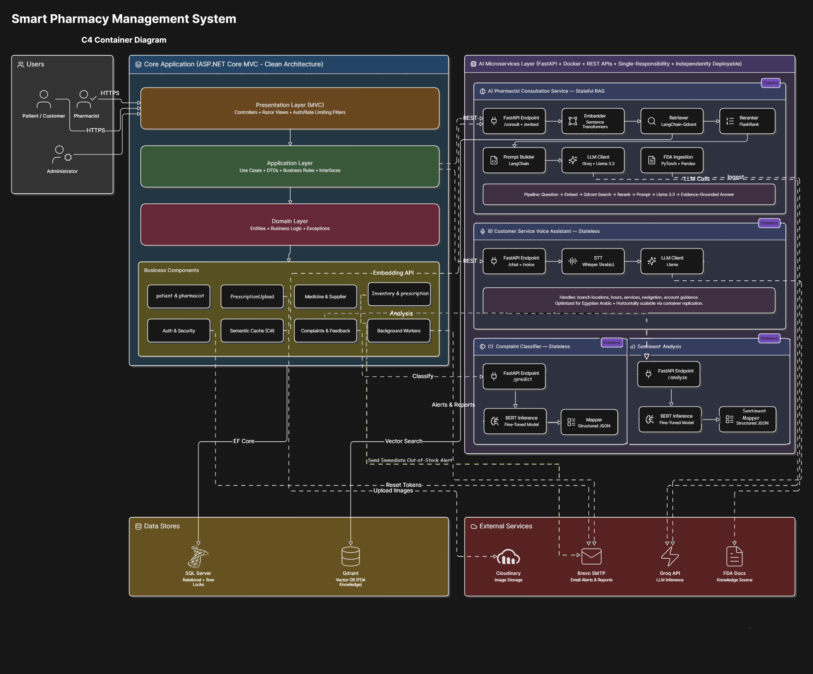

# 💊 PharmaSmart — Pharmacy Management System

An enterprise-grade Pharmacy Management System that models real-world pharmacy operations end to end. PharmaSmart helps pharmacists manage medications, prescriptions, patients, and suppliers efficiently, with a design that prioritizes **security, performance, and scalability**.

---

> 🧠 **Looking for the AI Engine?**  
> The intelligent features of PharmaSmart (FDA Drug RAG, Whisper Voice Assistant, BERT Sentiment Analysis, and Complaint Classification) are powered by a decoupled, containerized Python stack.  
> 👉 **[Explore the PharmaSmart AI Microservices Repository 🚀](https://github.com/Kerolos247/PharmaSmart-AI-Microservices)**
---

## 🚀 Key Features

### 🔐 Authentication, Security & Rate Limiting

The Infrastructure Layer implements a set of security controls designed to protect user accounts and preserve data integrity against automated and distributed attacks:

* **Context-Aware Brute-Force & Device Protection** — A dedicated security filter monitors authentication attempts and applies a dynamic, temporary device block when repeated failed logins are detected against a valid, registered account.
* **IP & Device-Level Rate Limiting** — Rate limiters constrain authentication requests at both the network and device level, reducing exposure to credential stuffing and distributed brute-force attempts before they reach core business logic.
* **Secure Password Recovery Workflow** — A "Forgot Password" flow issues time-bound verification and reset tokens, delivered via **Brevo** as the external SMTP provider.
* **Architectural Separation** — Security frameworks and persistence logic live in the **Infrastructure Layer**, while authorization and role-based access filters are enforced at the **Presentation Layer (MVC)**, keeping each concern in its proper place.

---

### 🤖 AI-Powered Features & Microservices Architecture

Computationally intensive AI workloads are isolated from core pharmacy operations in a dedicated **AI Microservices Layer**, built with **FastAPI (Python)** and containerized with **Docker**. Each microservice follows the single-responsibility principle, communicates with the ASP.NET MVC core exclusively over **RESTful APIs**, and is deployed on **Hugging Face**.

#### 1. Pharmacist Consultation Service (Stateful RAG Microservice)
Provides evidence-based pharmaceutical consultation through a stateful **Retrieval-Augmented Generation (RAG)** pipeline backed by a persistent vector knowledge base.

* **FDA Semantic Knowledge Base** — Converts official FDA pharmaceutical documentation into vector embeddings using **Sentence Transformers**.
* **Vector Storage** — Stores and indexes embeddings in a **Qdrant Vector Database** for high-performance semantic similarity search.
* **Retrieval Pipeline:**
  1. Receive the pharmacist's question.
  2. Generate a semantic embedding for the query.
  3. Search Qdrant for the most relevant FDA passages.
  4. Rerank candidates using **FlashRank** to improve retrieval precision.
  5. Build an augmented prompt from the reranked context.
  6. Generate a context-grounded answer using **Llama 3.3** via the **Groq API**.
  7. Return the answer together with its supporting source evidence.
* **Embedding API** — Exposes an embedding endpoint consumed by the ASP.NET MVC application to power the custom Semantic Cache.

#### 2. Customer Service Voice Assistant (Stateless AI Microservice)
An intelligent, stateless assistant that handles operational and customer-service inquiries on the web portal.

* **Egyptian Arabic Optimization** — Tuned to understand spoken Egyptian Arabic, allowing patients to interact naturally in their local dialect.
* **Speech-to-Text (STT)** — Transcribes Egyptian Arabic audio using **Whisper**.
* **Response Generation** — Accepts voice input through **Speech-to-Text (STT)** and generates natural-language text responses using **Llama**.
* **Supported Queries** — Branch locations, contact details, business hours, available services, site navigation help, and general support.
* **Horizontal Scalability** — Runs as a stateless service, allowing scaling through simple container replication.

#### 3. Sentiment & Complaint Classification Services (Stateless AI Microservices)
Two independent FastAPI-based stateless AI microservices integrated into the customer feedback workflow to monitor service quality.

* **Arabic Text Preprocessing** — Normalizes Arabic text and corrects common spelling variations before inference to improve classification accuracy.
* **Sentiment Analysis Model** — Uses a fine-tuned BERT model to classify customer feedback as positive or negative.
* **Complaint Classification Model** — Uses a separate fine-tuned BERT model to categorize complaints (e.g., Customer Service, Medical Staff, Delivery Delay).
* **Structured Output** — Returns prediction results as structured JSON to the .NET Core application for storage, analytics, and dashboard reporting.

#### 4. Custom C# Semantic Caching Component
A hybrid caching layer built natively into the C# codebase to optimize AI-layer performance.

* **Token & Cost Reduction** — Intercepts outgoing AI queries and checks for semantically similar historical requests.
* **Latency Reduction** — Serves cached responses for semantically matching queries, cutting redundant LLM token usage, API latency, and unnecessary microservice compute.
* **Performance Optimization** — Uses in-memory caching to reduce repeated NLP processing and improve response times.

---

### 🖥️ Core Backend & Architecture (.NET)

The backend is an enterprise-grade **ASP.NET Core MVC** application built on **Clean Architecture** principles, ensuring maintainability, separation of concerns, and testability.

#### 🏗️ Architectural Layers
* **Domain Layer** — Core business entities, domain logic, and custom domain exceptions. Fully independent of external frameworks, databases, or UI concerns.
* **Application Layer** — Orchestrates use cases, encapsulates business rules, and defines DTOs and interface abstractions used across the application.
* **Infrastructure Layer** — Handles external concerns: data persistence via Entity Framework Core, external API integrations, and the security/authentication implementation.
* **Presentation Layer (MVC)** — The user-facing layer, structured into modular components that handle HTTPS requests, enforce role-based access control, and render views.

#### 🧩 Core Backend System Components

* **Patient Lifecycle Management:** Manages comprehensive patient database profiles, executing highly optimized dynamic search queries alongside complete, secure CRUD (Create, Read, Update, Delete) business workflows.
* **Prescription Tracking & Fulfillment:** Coordinates the registration, tracking, and multi-criteria search of official medical prescriptions. Includes a dedicated transactional prescription fulfillment sub-system for processing medicine dispensing while enforcing strict prescription validation and business rules.
* **Cloud-Decoupled Online Prescription Media Storage:** Enables patients to dynamically upload digital or handwritten prescription images via the web portal. Uploaded files undergo strict server-side validation to enforce required file submission, restrict uploads to approved image formats (`.jpg`, `.jpeg`, `.png`), and limit file sizes to 5 MB before processing. The platform also provides efficient paginated prescription media retrieval to ensure scalable browsing and responsive performance when managing large volumes of uploaded prescriptions. To protect web server throughput, transactional metadata is securely persisted within the SQL Server relational instance, while heavy physical assets are synchronously offloaded to **Cloudinary** via background processing pipelines to preserve database performance.
* **Supplier Lifecycle Component:** Tracks extensive B2B vendor and distributor records, facilitating rapid supplier lookups and full standalone CRUD operations to streamline logistics and procurement workflows.
* **Granular Medicine Catalog Component:** Manages the full pharmaceutical registry (Generic names, Categories, and Dosage forms). Each medication profile is explicitly mapped to its active vendor, ensuring structured relational constraints across the entire domain dataset.
* **Comprehensive DTO Validation Layer:** Every request DTO is secured through server-side validation using ASP.NET Core Data Annotations, enforcing required fields, data formats, length constraints, file validation, and business input rules before any request reaches the application's business logic.
  
* **Inventory & Concurrency Control (Race Condition Mitigation):** 
  * **Concurrent Inventory Management:** Every validated sale, medicine dispense transaction, or manual administrative adjustment directly depletes or mutates live database stock, actively enforcing strict business fulfillment rules.
  * **Dual-Strategy Concurrency Control Layer (Race Condition Mitigation):** To maximize system throughput while maintaining absolute data integrity, the system splits its concurrency management into two distinct strategies based on contention probability:
  
  * **Pessimistic Locking (High-Contention / General Dispensing):** Engineered for scenarios with a high probability of race conditions—such as multiple pharmacists across different branches simultaneously dispensing the exact same high-demand drug from the same inventory batch. During checkout, the infrastructure layer utilizes EF Core to execute explicit raw SQL row-level hints on SQL Server (`SELECT ... WITH (XLOCK, ROWLOCK)`). This forces concurrent transaction threads to block synchronously until the active checkout commits, entirely eliminating double-selling or negative-stock anomalies.
  
  * **Optimistic Locking (Low-Contention / Multi-Pharmacist Prescription Race):** Applied to scenarios with an extremely low probability of conflict—specifically when two pharmacists accidentally attempt to open and fulfill the exact same customer prescription identifier at the same millisecond. Instead of blocking the database threads with heavy locks, the system utilizes a dedicated concurrency token (`RowVersion` / `Timestamp`). If a conflict occurs during the final saving phase, the database detects the mismatch, rejects the second transaction, and throws a controlled concurrency exception, prompting the user to refresh the stale data without hindering database performance.
 
* **Database Query Optimization:** Frequently queried entities are optimized through strategic SQL indexes and extensive use of Entity Framework Core's `AsNoTracking()` for read-only operations, reducing query overhead and improving data retrieval performance.
  
* **Custom Semantic Caching Middleware:** Implemented natively within the C# application codebase as an intelligent interception layer. It converts outgoing queries via the FastAPI embedding service and evaluates them against an in-memory repository (`IMemoryCache`). If semantically identical queries exist, it fetches cached historical responses, cutting redundant LLM token overhead, slashing API response latency, and preventing microservice compute exhaustion.
* **Customer Complaints & Feedback AI Component:** An end-to-end user feedback intake pipeline embedded within the patient portal. Submissions are securely piped to a fine-tuned BERT classification microservice that performs automated text preprocessing, Multi-Class Sentiment Analysis, and Topic Classification to route the issue into specific departments (e.g., *Customer Service, Medical Staff,Delivery delay*) for administrative analytics.
* **Automated Operational Awareness & Alerting:** Utilizes managed background workers (`IHostedService`) coordinated with **Brevo (External SMTP)** to guarantee continuous administrative oversight:
  * **Immediate Low-Stock Alerts:** Automatically dispatches urgent notification emails to the administration the exact millisecond a medicine's stock drops below its critical threshold during a transaction.
  * **Weekly Shortage Reporting:** A scheduled background service scans database records to compile an automated weekly breakdown of depleted or critically low-stock medicines, delivering it directly to the admin's inbox.

---

## 🛠️ Detailed Technology Stack

The platform follows a polyglot architecture, balancing high-throughput transactional integrity with efficient machine learning inference.

### 🖥️ Backend Frameworks & Core Ecosystem
* **ASP.NET Core 8 (MVC)** — Primary host for the enterprise web engine, providing dependency injection, secure routing, and separation of concerns.
* **FastAPI (Python 3.11)** — Asynchronous framework powering the AI microservices layer, chosen for its low overhead and native async support.
* **Docker** — Containerizes each Python AI microservice for environmental isolation and consistent deployment.

### 💾 Data Persistence, Querying & Concurrency
* **Entity Framework Core 8** — ORM managing migrations, Fluent API configuration, and database transactions.
* **SQL Server** — Relational database engine handling consistent tables, transaction logs, and row-level locks.
* **LINQ** — Type-safe, compiled queries used in the Application layer for efficient server-side data access.
* **Qdrant Vector Database** — Stores, indexes, and queries semantic embeddings for the RAG consultation pipeline.

### 🔐 Authentication & Identity
* **ASP.NET Core Identity** — Manages authentication, password hashing, persistent cookies, and role-based access control, with dedicated **Administrator** and **Pharmacist** roles to enforce secure, permission-based access across the system.

### 🤖 Machine Learning, NLP & AI Core
* **Llama 3.3 (via Groq API)** — Foundational LLM for context-grounded response generation in consultation and support pipelines.
* **Fine-Tuned BERT** — Task-specific model for sentiment analysis and multi-class complaint classification.
* **Whisper (OpenAI)** — Automatic speech recognition for transcribing Egyptian Arabic audio input.
* **Sentence Transformers & PyTorch** — Convert clinical text into semantic vector embeddings.
* **LangChain & FlashRank** — Orchestrate the RAG execution graph and apply context-aware reranking over retrieved passages.

### ☁️ Infrastructure & Third-Party Integrations
* **Cloudinary SDK** — Non-blocking cloud storage for prescription assets, offloaded from the application server.
* **Brevo API (formerly Sendinblue)** — SMTP provider for token delivery and automated reporting.
* **Microsoft.Extensions.Caching (`IMemoryCache`)** — In-memory storage backing the custom semantic cache.
* **JavaScript (ES6+)** — Powers responsive UI behavior, client-side validation, and asynchronous requests to backend controllers.
* **Groq API** — High-performance inference platform powering low-latency Llama 3.3 response generation for the AI consultation and customer support microservices.

## 🏗️ C4 Architecture Diagram

The following C4 diagram provides a high-level overview of the system architecture and interactions between the ASP.NET MVC application, AI microservices, external services, and supporting infrastructure.

---

### 📺 Video Demo & System Walkthrough

Click the badge above or **[this link](https://drive.google.com/file/d/1zOMZyWdEbH-0MTeFAaWENsiTbNgLzKmx/view?usp=drive_link)** to watch a video demonstration covering the system's core capabilities and high-performance engineering:

*   ⚡ **Race Conditions & Concurrency Control:** Deep dive into how we combined Pessimistic & Optimistic locking to handle concurrent inventory updates safely.
*   💬 **FDA RAG Chatbot:** Interactive chatbot powered by Retrieval-Augmented Generation (RAG) to fetch and synthesize FDA-aligned medical information.
*   🤖 **AI Patient Support:** Interactive assistant guiding patients on how to use the platform, upload prescription images, locate the pharmacy, and retrieve contact details or operating hours.
*   📧 **Zero-Stock Automated Alerts:** Background services (`IHostedService`) monitoring inventory and dispatching instant email alerts when medicine stock hits zero.
